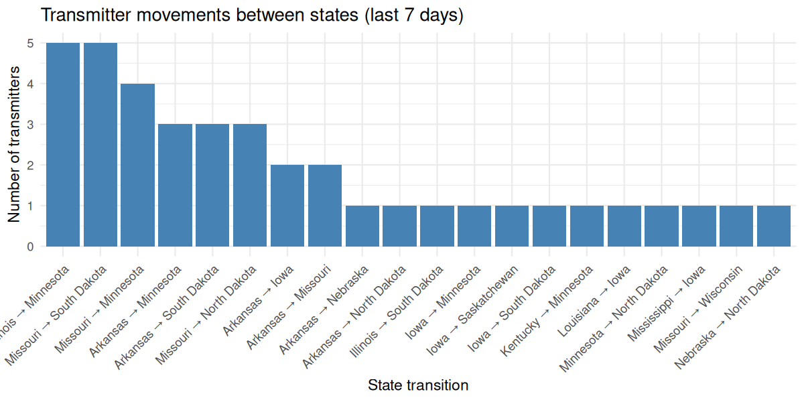
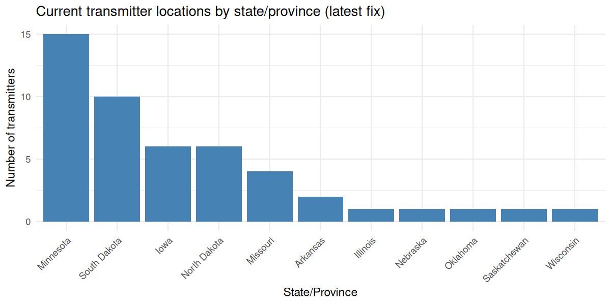

# Weekly Mallard Migration Status

**Window:** 2026-03-09 to 2026-04-08 (UTC)
**Transmitters reporting:** 48  |  **GPS fixes:** 30,871

## Current state/province distribution (latest fix per transmitter)

- Minnesota: 31.2% (n=15)
- South Dakota: 20.8% (n=10)
- Iowa: 12.5% (n=6)
- North Dakota: 12.5% (n=6)
- Missouri: 8.3% (n=4)
- Arkansas: 4.2% (n=2)

## Migration status (by transmitter)

- Local: 6 (12.5%)
- Transitional: 1 (2.1%)
- Migrating: 41 (85.4%)

## Notes

State/province percentages reflect the **current location of each transmitter** based on its most recent GPS fix within the last 7 days, rather than the total number of GPS fixes collected. Most transmitters continue to show **local late-winter movements** within primary wintering areas. A subset of birds are showing **transitional behavior** (larger net displacement without strong latitudinal gain), and the **leading edge of spring migration** is evident among birds with substantial northward movement over the last week.

## Leading movement this week (net displacement)

- 230381: **1,565 km** net, lat change **13.66°**, current admin area **North Dakota**
- 377518: **1,304 km** net, lat change **9.33°**, current admin area **Saskatchewan**
- 236662: **1,299 km** net, lat change **10.39°**, current admin area **South Dakota**

## State-to-state movements (last 7 days)

## Current transmitter location distribution

## Transmitter location distribution over time (last 30 days)

[Interactive bar chart](data/state_counts_slider.html)

