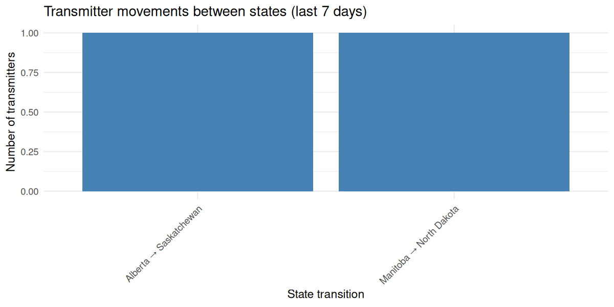
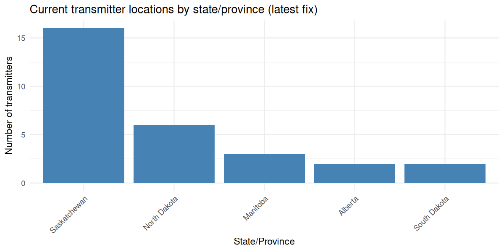

# Weekly Mallard Migration Status

**Window:** 2026-05-01 to 2026-05-31 (UTC)
**Transmitters reporting:** 44  |  **GPS fixes:** 25,802

## Current state/province distribution (latest fix per transmitter)

- Saskatchewan: 40.9% (n=18)
- Minnesota: 13.6% (n=6)
- North Dakota: 13.6% (n=6)
- Manitoba: 11.4% (n=5)
- Alberta: 9.1% (n=4)
- Iowa: 4.5% (n=2)

## Migration status (by transmitter)

- Local: 24 (54.5%)
- Transitional: 6 (13.6%)
- Migrating: 14 (31.8%)

## Notes

State/province percentages reflect the **current location of each transmitter** based on its most recent GPS fix within the last 7 days, rather than the total number of GPS fixes collected. Most transmitters continue to show **local late-winter movements** within primary wintering areas. A subset of birds are showing **transitional behavior** (larger net displacement without strong latitudinal gain), and the **leading edge of spring migration** is evident among birds with substantial northward movement over the last week.

## Leading movement this week (net displacement)

- 377516: **1,241 km** net, lat change **7.75°**, current admin area **Alberta**
- 377527: **1,133 km** net, lat change **7.45°**, current admin area **Alberta**
- 377539: **  986 km** net, lat change **6.03°**, current admin area **Alberta**

## State-to-state movements (last 7 days)

## Current transmitter location distribution

## Transmitter location distribution over time (last 30 days)

[Interactive bar chart](data/state_counts_slider.html)

